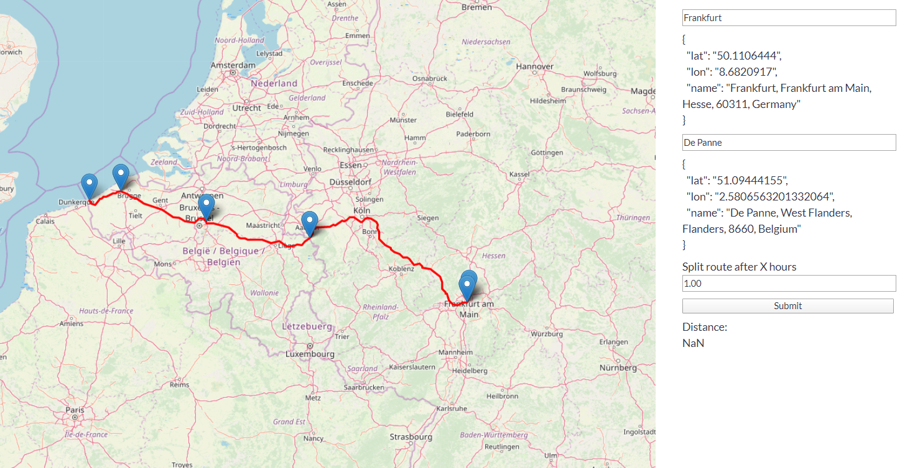

# Idea

When planning a long road trip (multiple days to weeks), it will be nice to indicate a your destination and let the code calculate the stops on your way automatically.

I want the stops to be relatively uniformly distributed, but also to be placed in the cities so that we can do the sightseeing while we make a break.

# Code

Uses leaflet to show the map and leaflet plugin to calculate the route between two points.

Then it splits the route into sections (for example 1h drive time) and then tries to find a nearest city near the section splits.

# Desired output

You specify you want to go from Frankfurt to Berlin and stop every 2h.

The code gives you this route with stops in the following cities:
 * example
 * example
 * example

That's all.
